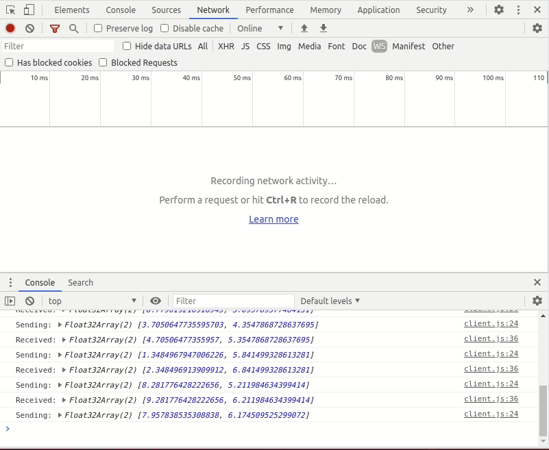

# websocket-test
For testing if it is possible to send/receive JSON and binary websockets on the same websocket.
Result: it's possible!

This code runs a python websocket server using aiohttp, and uses the WebSocket API in the browser.

The client sends JSON and binary messages. The server 'echos' these back to the client, with some modification.




In JavaScript, we can check the type of WebSocket message received using 

```javascript
function isString(s) {
  return typeof (s) === 'string' || s instanceof String;
}

function isBinary(b) {
  return b instanceof ArrayBuffer;
  // similar to isinstance() in Python
}
```

This seems to be the recommended way.
- https://stackoverflow.com/questions/19322635/how-to-parse-both-data-binary-websocket-messages/19324928 

## Requirements:
```bash
pip install aiohttp
# also needs numpy
```

## Running
To start server:
```bash
python app.py
```
Then, open client/client.html file in browser and look at Debug view.

## Running server with live reloading
```bash
pip install aiohttp-devtools
adev runserver -p 8080 --livereload
```
